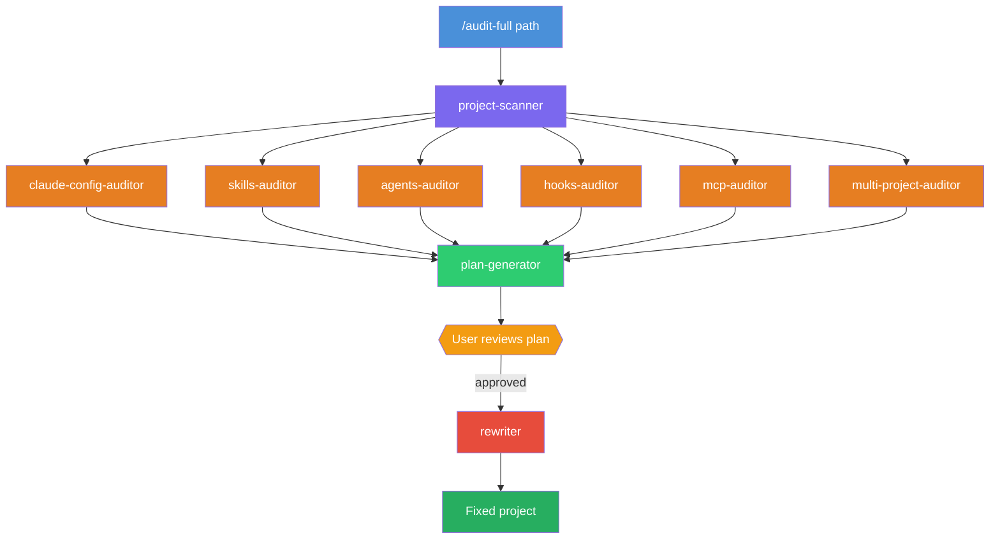
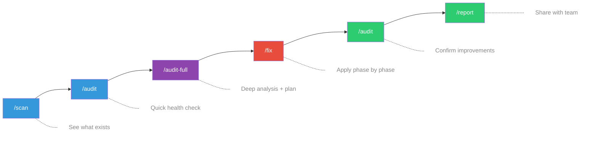
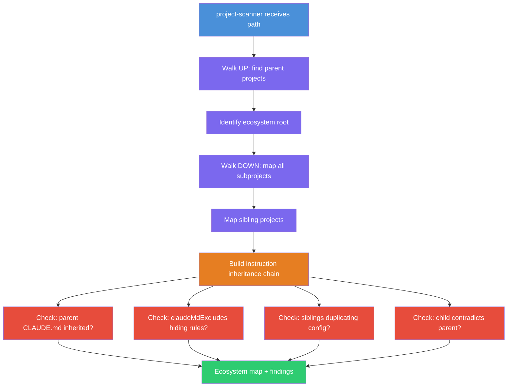

# claude-doctor

Your Claude Code projects deserve a checkup.

**claude-doctor** is a specialized toolkit that audits, diagnoses, and fixes the Claude Code configuration of any project. Think of it as a senior consultant that knows every detail of CLAUDE.md inheritance, settings scopes, skills, agents, hooks, rules, memory, MCP servers, and permissions — and uses that knowledge to make your projects work better with Claude Code.

Whether you have a single project with a basic CLAUDE.md or a complex monorepo with dozens of subprojects, claude-doctor finds what's missing, what's broken, and what could be better.

## Why?

Most Claude Code projects leave performance on the table:

- CLAUDE.md files that are too long, too vague, or missing entirely
- Skills without descriptions (Claude can't auto-detect when to use them)
- Agents with unrestricted tool access (violating least privilege)
- Monorepo subprojects that lose parent instructions without anyone noticing
- Missing deny rules for destructive operations
- Hooks that try to block on events that don't support blocking

claude-doctor catches all of this — and generates a prioritized plan to fix it.

## Quick Start

```bash
git clone https://github.com/damianwajser/claude-doctor.git
cd claude-doctor
claude
```

Then point it at any project:

```
/audit /path/to/your/project
```

## Commands

| Command | What it does |
|---------|-------------|
| `/scan <path>` | Map all Claude Code config files — just the facts, no judgment |
| `/audit <path>` | Quick checkup — health score (A-F) and top 5 issues |
| `/audit-full <path>` | Full examination — 6 auditors in parallel + prioritized fix plan |
| `/fix <path> [--phase N]` | Apply fixes phase by phase, with confirmation and backups |
| `/report <path>` | Export findings as a shareable markdown report |
| `/compare <path-A> <path-B>` | Side-by-side diff of two project configurations |
| `/init-target <path>` | Set up optimal Claude Code config from scratch |

## What It Checks

| Area | Examples |
|------|----------|
| **CLAUDE.md** | Size (<200 lines), structure, build/test commands, generic advice, contradictions |
| **Settings** | Deny-first permissions, sandbox, secrets in config, `claudeMdExcludes` accidents |
| **Skills** | Missing descriptions, unrestricted tools, missing `context: fork`, `$ARGUMENTS` usage |
| **Agents** | Tool access (least privilege), model selection, `maxTurns`, single responsibility |
| **Hooks** | Event types vs blocking capability, exit codes, timeouts, infinite loop risks |
| **MCP Servers** | Hardcoded secrets, `alwaysAllow` scope, localhost-only validation |
| **Rules** | Path pattern accuracy, frontmatter, cross-file conflicts |
| **Monorepo** | Parent-child inheritance, lost context, duplicated config, orphaned subprojects |

## How It Works

### Full Audit Pipeline



9 specialized agents, each focused on one area. Auditors are read-only (orange). Only the rewriter (red) can modify files — and only after you approve.

### Typical Workflow



### Monorepo Scanning



## Monorepo Support

The `multi-project-auditor` specializes in the hardest problem — **instruction inheritance across project boundaries**:

- Walks UP to find parent CLAUDE.md files that cascade down
- Walks DOWN to map every subproject
- Detects 10 patterns of context loss (orphaned children, conflicting instructions, `claudeMdExcludes` hiding parent rules, siblings reinventing the same config)
- Always recommends root-level solutions over per-child duplication

```bash
/audit-full /path/to/monorepo/packages/api --include-siblings
```

## Safety

- **Read-only by default** — auditors can only read, never write
- **Single writer** — only the `rewriter` agent can modify files, and only after your explicit approval
- **Automatic backups** — originals saved to `.claude-audit-backup/` before any change
- **Sandboxed** — filesystem sandbox enabled
- **Deny-first** — destructive operations (`rm -rf`, `sudo`, `git push`, `git reset --hard`) are blocked at the permission level

## Requirements

- [Claude Code](https://claude.ai/code) installed and authenticated
- `jq` (for JSON validation hooks)

## License

MIT
